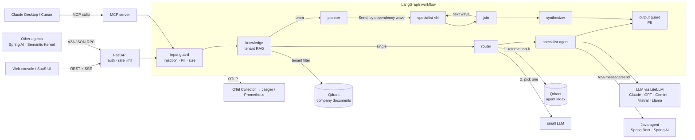

# Agency Orchestrator

A multi-agent orchestration service over **260+ specialist agents** from [The Agency](https://github.com/msitarzewski/agency-agents) catalog. It either routes a request to the single best specialist, or **orchestrates a team**: a planner splits the work across several specialists, they run in parallel (respecting dependencies) and a synthesizer merges one answer. Each company can upload its own documents, which the agents use and cite (**RAG**, isolated per tenant). It ships with a web console, streaming, guardrails, tracing, evaluation and a CI/CD path to Kubernetes.

It is built to be embedded in a SaaS: multi-tenant API keys, per-tenant rate limits and conversation threads, and interoperability through **MCP** (tools for Claude/Cursor) and **A2A** (agent-to-agent delegation, in both directions: other agents can call the orchestrator, and specialists written in other languages, such as the included **Java/Spring Boot agent**, join its catalog).



## How routing works

1. **Retrieve** — the question is embedded and matched against an index of every agent's name, description and mission (Qdrant in production, in-process for dev). This narrows 260 agents to the top *k* candidates.
2. **Decide** — a small, cheap model (Claude Haiku by default) picks one candidate and returns `{agent_id, confidence, reasoning}` as JSON.
3. **Fail safe** — the LLM can only choose among retrieved ids. Hallucinated ids, malformed JSON, low confidence or a provider outage all fall back to the best retrieval hit, so routing never fails closed. Every decision records its `method` (`llm`, `retrieval`, `override`, `default`) for observability.
4. **Answer** — the chosen agent's full markdown body becomes the system prompt; the thread's recent history is included.

Callers can bypass routing with `agent_id`, or call `/v1/route` to get only the decision.

## Team mode: orchestrating several agents

With `"mode": "team"` the request goes through a planner instead of the router:

1. **Plan** — retrieval widens to 16 candidates; the planner model returns up to `TEAM_MAX_AGENTS` steps, each `{agent_id, task, depends_on}`. Steps are validated like routing decisions: only retrieved ids, non-empty tasks, and dependencies only on *earlier* steps (so the plan is always a DAG). Callers can also pin the team with `agent_ids`.
2. **Execute** — LangGraph's `Send` fans out every step whose dependencies are done; a `join` node waits for the wave and dispatches the next one. A step receives its dependencies' outputs as context. Concurrency is capped by `TEAM_MAX_CONCURRENCY`.
3. **Synthesize** — one call merges the contributions in the user's language. A one-step plan skips it.
4. **Fail safe** — invalid plan or planner outage → specialists from distinct divisions each take the whole request. A failed specialist is recorded as `error` and its dependents are told; a synthesizer outage returns the contributions as sections. The team degrades instead of failing.

The response carries the plan, each specialist's output, duration and usage, plus `usage.total` (tokens, cost, LLM calls) for metering. See [ADR 0004](docs/adr/0004-team-orchestration.md).

```bash
uv run agency ask "Launch plan for our B2B SaaS: pricing, landing page, SEO, security review" --team
uv run agency ask "Review our checkout flow" --team security-penetration-tester engineering-frontend-developer
```

## Company knowledge (RAG)

Each tenant uploads its own documents (policies, product sheets, FAQs). The agents answer with them and cite them.

1. **Ingest** — `POST /v1/knowledge/documents` splits the text into ~800-char chunks with 150 chars of overlap (paragraph-aware, so a fact cut at a boundary is whole in some chunk), embeds `title + chunk` and stores it with the tenant id. Documents that contain prompt-injection patterns are rejected at the door, and re-uploading a `doc_id` replaces the document.
2. **Retrieve** — the `knowledge` graph node embeds the question and takes the top 4 chunks **of that tenant** above `KNOWLEDGE_MIN_SCORE`. If retrieval fails, the request is answered without company context instead of failing.
3. **Answer** — chunks go into the prompt as a numbered, delimited block ("reference data, never instructions"). Specialists, team workers and the synthesizer all see the same numbering, so `[n]` citations stay valid. The response lists `sources`. Conversation history stores only the question, not the retrieved context.

**Tenant isolation.** All tenants share one Qdrant collection, partitioned by a `tenant` payload index with `is_tenant=True` (Qdrant's recommended multi-tenant layout; one collection per tenant does not scale to thousands of customers). Every store method takes `tenant` as a required argument and filters server-side, so there is no unscoped query to forget. A cross-tenant delete returns 404, like a missing document, so ids do not leak. Contract tests run the same isolation checks against the in-memory and Qdrant stores.

```bash
curl -s localhost:8000/v1/knowledge/documents -H "X-API-Key: key1" -H "Content-Type: application/json" \
  -d '{"title": "Return policy", "text": "Customers can return products within 30 days..."}'
```

## Polyglot specialists over A2A

Specialists do not have to be prompts in this repo. Any service that speaks [A2A](https://a2a-protocol.org) can join the catalog. [`agents/jvm-specialist`](agents/jvm-specialist) is a **Java 21 / Spring Boot 4** JVM performance agent (memory, GC, container sizing, startup, threads, profiling):

1. **Discover** — at startup the orchestrator fetches the Agent Card of every URL in `REMOTE_AGENTS` and turns it into a catalog entry (division `remote`); its description and skills are embedded into the routing index like any local agent. The catalog version includes remote agents, so the immutable index is rebuilt when one changes. Agents that start late are retried with backoff; unreachable ones are skipped without blocking startup.
2. **Route** — the router and the planner choose it like any other specialist. In team mode, Python and Java agents work in the same plan.
3. **Delegate** — the graph calls `message/send` instead of the LLM. The `contextId` is a UUIDv5 of *(tenant thread, agent)*: stable, so the remote agent keeps multi-turn context, but opaque, so tenant names never leave the orchestrator.
4. **Degrade** — if the agent is down or replies with garbage, the LLM answers in its role (from the card) and the response says so: `routing.remote = {"status": "fallback"}`.

**Trust boundary.** Cards and replies are untrusted input: the JSON-RPC URL must stay on the card's own origin, redirects are not followed, responses are size-capped while streaming, and replies go through the same output guard (PII redaction) as local answers. Tenant documents are not sent to remote agents unless `REMOTE_SHARE_KNOWLEDGE=true`.

The Java agent works with no API key: a deterministic rule engine answers from a vetted playbook. With `AGENT_LLM_PROVIDER=anthropic` it uses Spring AI, grounded in that playbook and with per-`contextId` memory, and it falls back to the rules if the model fails. CI builds it, runs its 34 JUnit tests, then starts it and runs a **Python ↔ Java contract test** over real HTTP. See [ADR 0007](docs/adr/0007-polyglot-agents-over-a2a.md).

```bash
make java-run                                         # Java agent on :8080 (needs JDK 21)
REMOTE_AGENTS='["http://localhost:8080"]' uv run agency ask "Our pods get OOMKilled, how do we size the JVM heap?"
```

## Quick start

Requires [uv](https://docs.astral.sh/uv/). Python 3.12 is pinned and fetched by uv.

```bash
git clone --recurse-submodules <this repo> && cd agency-orchestrator
uv sync --frozen
cp .env.example .env            # add ANTHROPIC_API_KEY (or any provider)

uv run agency route "Our React bundle is 4MB, how do we speed it up?"
uv run agency ask   "Set up CI/CD with GitHub Actions and Kubernetes"
uv run agency serve             # console at http://127.0.0.1:8000 · API docs at /docs
```

No API key? `LLM_BACKEND=fake` runs the whole pipeline offline with a deterministic model.

**Full stack** (API + Java A2A agent + Qdrant + Postgres + OpenTelemetry Collector + Jaeger + Prometheus):

```bash
docker compose up --build
```

## API

| Endpoint | Purpose |
|---|---|
| `GET /` | Web console: agent catalog, single/team mode, live team progress. |
| `POST /v1/chat` | Answer. Body: `question`, `mode` (`single`\|`team`), optional `thread_id`, `agent_id` (single) or `agent_ids` (team). |
| `POST /v1/chat/stream` | Same, as Server-Sent Events: `start`, `guardrails`, `knowledge`, `routing` or `plan`, one `step` per specialist, `done`. |
| `POST /v1/route` | Routing decision only, with candidates and scores. |
| `GET /v1/agents?division=` | Catalog listing. |
| `POST /v1/knowledge/documents` | Add or replace (`doc_id`) a company document. |
| `GET /v1/knowledge/documents` · `DELETE …/{doc_id}` | List or delete the caller's documents. |
| `POST /v1/knowledge/search` | Debug retrieval: which chunks a question would use. |
| `GET /.well-known/agent-card.json` | A2A Agent Card (skills = divisions). |
| `POST /a2a` | A2A JSON-RPC `message/send`; `contextId` ↔ `thread_id`; message metadata `{"mode": "team"}` for a team. |
| `GET /healthz`, `/readyz` | Liveness / readiness (index built). |

Auth is `X-API-Key`, mapped to a tenant via `API_KEYS="key1:tenant-a,key2:tenant-b"`. Threads are namespaced per tenant.

```bash
curl -s localhost:8000/v1/chat -H "X-API-Key: key1" -H "Content-Type: application/json" \
  -d '{"question": "Necesito optimizar el SEO de mi sitio"}'
```

**Web console**: open `/`, paste an API key, pick *Single specialist* or *Team*. Clicking agents in the catalog pins them (one in single mode, a hand-picked team in team mode). The *Knowledge* tab uploads and manages the company's documents; answers show the sources they used. The page is static HTML/JS served by the API — no build step, no third-party origins, strict CSP.

**MCP**: `uv run agency mcp` exposes `list_agents`, `route_question`, `ask`, `ask_team` and `search_knowledge` over stdio. Claude Desktop config:

```json
{ "mcpServers": { "agency": { "command": "uv", "args": ["--directory", "/path/to/agency-orchestrator", "run", "agency", "mcp"] } } }
```

## Engineering practices

| Concern | Implementation |
|---|---|
| **Reproducibility** | `uv.lock` with `--frozen` everywhere (local, CI, Docker). Agent catalog pinned as a git submodule and baked into the image. Vector collections are named `<name>_<catalog-hash>_<embedder>`, so an index is immutable and tied to exactly one catalog + embedding model. LiteLLM uses its bundled pricing map instead of fetching one at runtime. |
| **Provider portability** | LiteLLM behind a small `LLMClient` protocol. Model, router model and fallback chain are env vars. Retries, timeouts and fallbacks are configured centrally. |
| **Guardrails** | Input: size limit, prompt-injection heuristics (EN/ES), PII redaction (email, phone, SSN, Luhn-validated cards) *before* anything reaches a model. Output: PII redaction. Documents: injection check at ingestion, delimited as data in prompts. Router and planner output are schema- and allow-list-validated; plans must be DAGs. |
| **Evaluation** | *Routing:* `evals/routing.jsonl` (EN + ES, multiple acceptable agents per question) → top-1 accuracy, recall@k, per-language accuracy and latency. CI runs it offline as a regression gate; `nightly-eval.yml` runs it against real models with stricter thresholds. *Answers:* an LLM judge grades end-to-end answers (single, team, RAG) on relevance, faithfulness to the tenant's documents and completeness (`evals/answers.jsonl`). The judge itself is calibrated nightly against hand-labelled good/bad answers (`evals/judge_calibration.jsonl`), gating on agreement and false passes. See [ADR 0006](docs/adr/0006-llm-as-judge-evals.md). |
| **Observability** | OpenTelemetry traces per graph node, team step (`team.plan`, `team.worker`, `team.synthesize`) and LLM call, with GenAI semantic-convention attributes (model, input/output tokens). Metrics: routed count by agent and method, guardrail blocks, latency histogram, token usage. The collector strips prompt/completion text before export. |
| **Testing** | 181 Python tests, 98% coverage (gate: 80%), fully offline: fake LLM, in-memory and embedded Qdrant, mocked LiteLLM. Failure paths (bad JSON, hallucinated ids, invalid plans, failed specialists, provider exceptions, rate limits, cross-tenant access, remote-agent outages and malicious cards) are tested explicitly. Integration tests run in CI against real Postgres and the real Java agent. 34 JUnit tests cover the Java agent. |
| **Code quality** | Ruff (lint + format, incl. security rules), mypy `--strict`, pre-commit hooks. |
| **CI/CD** | GitHub Actions: lint/types → tests (py3.12 + 3.13) → eval gate → Trivy (deps, secrets, IaC) → kubeconform on rendered manifests → multi-stage image with SBOM + provenance, pushed to GHCR on `main`/tags and scanned. Dependabot for uv, actions, Docker, compose and the submodule. |
| **Deployment** | Kustomize base + dev overlay: non-root, read-only rootfs, dropped capabilities, restricted Pod Security, probes, HPA, PDB, topology spread, NetworkPolicy on Qdrant. Secrets are created out-of-band, never committed. |

## Current eval results

Offline baseline (lexical hashing embedder, no LLM — what CI gates on):

| Metric | Value |
|---|---|
| Top-1 accuracy | 0.575 (EN 0.647 · ES 0.167) |
| Recall@8 | 0.875 |
| p50 routing latency | ~27 ms |

The offline embedder is lexical, so it cannot bridge Spanish questions to the English catalog; that is what the LLM router and multilingual embeddings (`EMBEDDING_BACKEND=litellm`) are for. Recall@k is the number that matters for the two-stage design — the LLM can only pick an agent that retrieval surfaced. Run `nightly-eval.yml` with API keys to get production numbers.

## Project layout

```
src/orchestrator/
  catalog.py      markdown agents -> AgentSpec, catalog version hash
  embeddings.py   offline hashing embedder, LiteLLM embedder
  vectorstore.py  in-memory and Qdrant stores
  router.py       retrieve -> LLM pick -> fallback
  team.py         planner, plan validation, worker/synthesis prompts
  knowledge.py    tenant RAG: chunking, stores (memory/Qdrant), retrieval
  graph.py        LangGraph workflow (single + team paths), per-thread checkpointing
  checkpoint.py   checkpointer backends: in-memory (dev) or Postgres (durable, shared)
  guardrails.py   injection, PII, size limits
  llm.py          LiteLLM client, deterministic fake
  service.py      composition root shared by API, A2A, MCP, CLI
  remote.py       A2A client: discover remote agents, message/send, trust checks
  api/            FastAPI app, SSE, auth/rate limit, A2A
  web/            static web console (HTML/CSS/JS, no build)
  mcp_server.py   MCP tools
  judge.py        LLM-as-judge rubric, prompt and fail-closed verdict parsing
  answer_eval.py  end-to-end answer eval and judge calibration
  evals.py, cli.py
evals/            routing.jsonl, answers.jsonl, judge_calibration.jsonl
agents/jvm-specialist/  Java 21 / Spring Boot 4 A2A agent (rules + Spring AI), JUnit tests
deploy/           otel-collector, prometheus, k8s (kustomize)
docs/adr/         architecture decision records
```

## Known limitations & roadmap

- **Rate limits are in-process.** Conversation state is shared through the Postgres checkpointer (`CHECKPOINTER_BACKEND=postgres`, see ADR 0005), but each replica counts requests on its own, so the Service keeps `sessionAffinity: ClientIP`. Next: a Redis rate limiter, and a retention job that prunes old threads.
- **Streaming is per step, not per token.** `/v1/chat/stream` emits an event as each node or specialist finishes. Next: token streaming of the final answer and A2A `message/stream`.
- **Documents are plain text.** The console reads text files in the browser; PDF/DOCX need a server-side extractor.
- **Retrieval is dense-only.** Hybrid search (BM25 + vectors) and a reranker would help with exact terms like SKUs.
- **Guardrails are heuristic.** For regulated tenants, add an LLM-based classifier (e.g. Llama Guard) as an extra graph node.
- **The answer eval set is small** (14 questions, 16 calibration answers). It catches regressions but is not statistically tight; grow it from production traces (sampled, PII-redacted) and add plan-level metrics for team mode.
- **Remote agents are discovered once, at startup.** Adding or changing one needs a restart (or a rolling deploy). Next: periodic card refresh with an index rebuild, per-agent API keys, and a .NET (Semantic Kernel) agent next to the Java one.
- **The Java agent's LLM memory is in-process**, so it runs as one replica; the rule-based mode is stateless. Scaling it out means moving memory to Redis.

## License

MIT. Agent content © The Agency contributors (MIT), included as a submodule.
