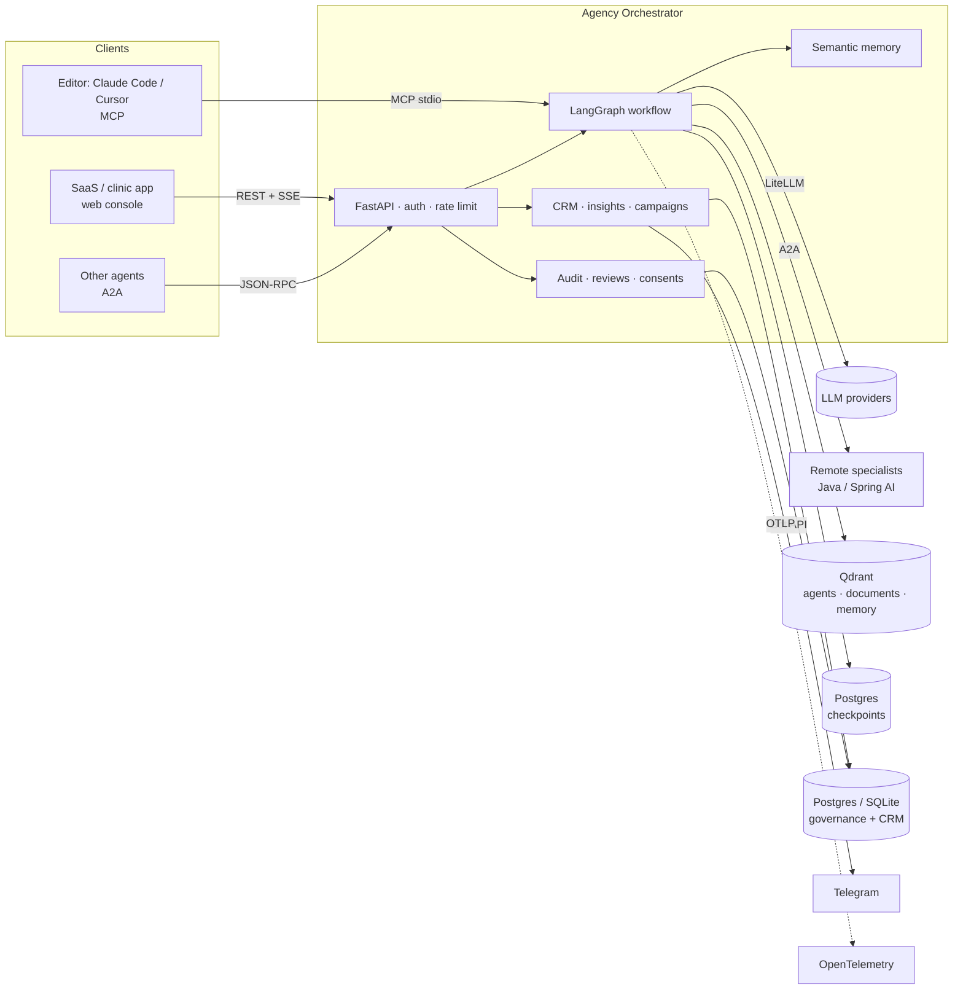
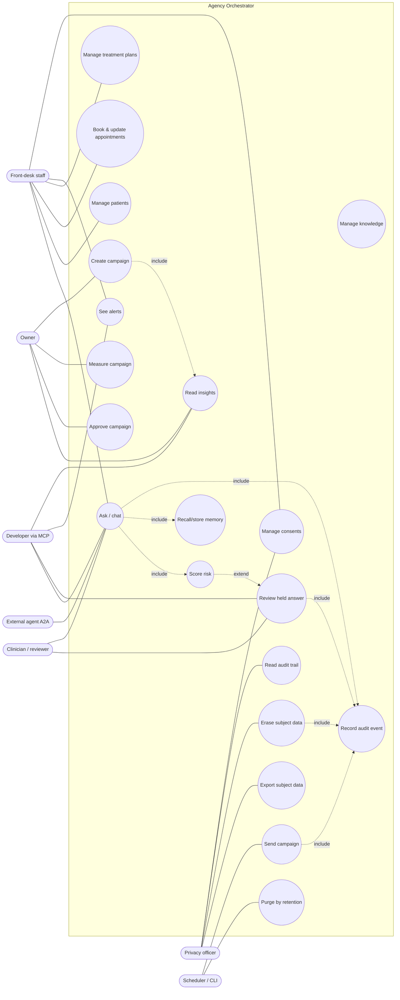
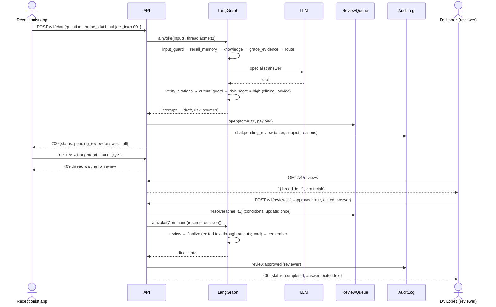
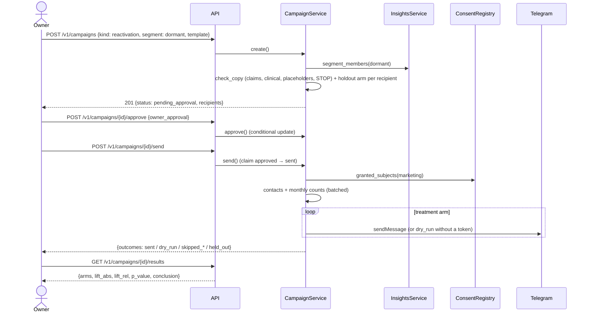
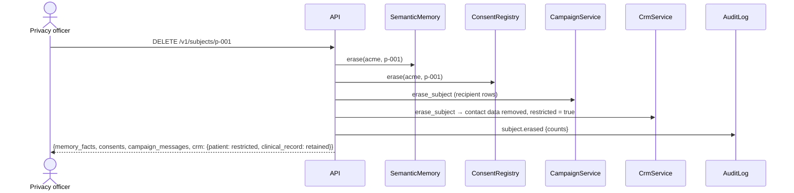
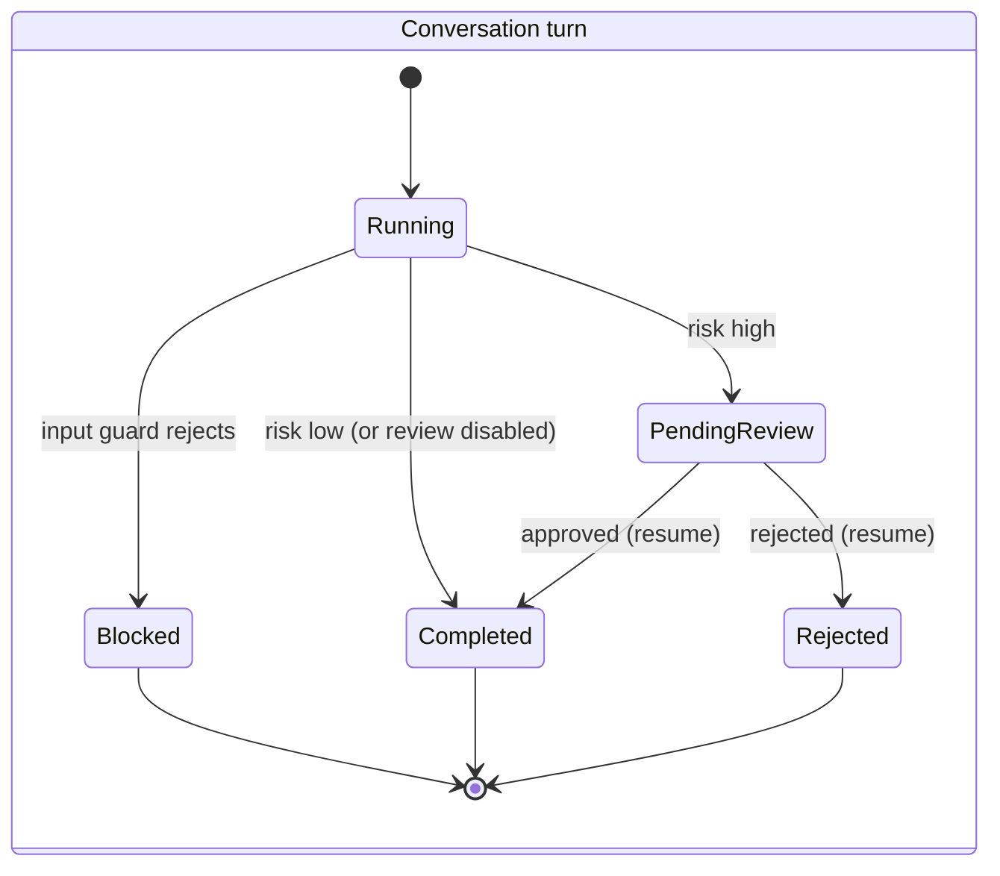
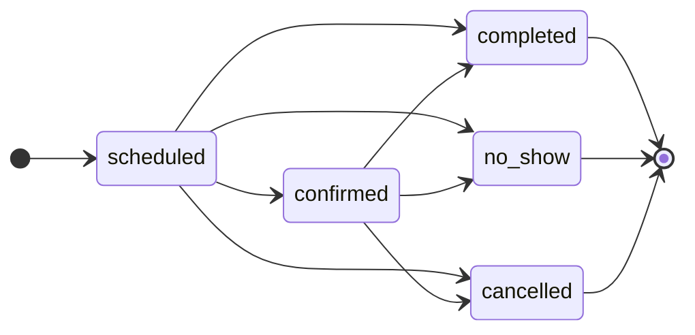
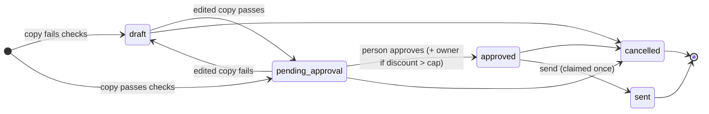

# Software Requirements Specification (SRS)

## Agency Orchestrator — AI-native CRM with governance (ERM) for small businesses

| | |
|---|---|
| **Document** | Software Requirements Specification, version 1.0 |
| **Date** | 2026-09-30 |
| **Product version** | `agency-orchestrator` 0.1.0 at commit `08f1558` and later |
| **Template** | IEEE Std 830-1998, as modified by B. H. C. Cheng (Michigan State University): the same section structure used by the *Book E-Commerce System (BECS)* SRS, extended with traceability and compliance appendices |
| **Owner** | Taty Santillan (GitHub `tatymarisol44-cmyk`) |
| **Status legend** | **I** = implemented and tested in this version · **P** = partially implemented · **F** = planned (future), not implemented |

---

## 1 Introduction

This Software Requirements Specification records what the Agency Orchestrator does, what it is expected to do next, and the constraints under which it operates. It describes functionality, external interfaces, quality attributes and design constraints. Each requirement is numbered, has a status and names the tests that verify it, so the document can serve as the reference for an exhaustive review and for later development.

### 1.1 Purpose

The purpose of this SRS is to define the requirements of the Agency Orchestrator and its business suite: routing and multi-agent orchestration over a catalog of specialist agents, company knowledge (RAG) with evidence gating, human review of high-risk answers, governance (audit, consents, data-subject rights), semantic memory, a CRM, SQL-computed insights, and loyalty campaigns.

The intended audience is:

- the project owner and reviewers performing the audit of this version;
- developers extending the system (new industry packs, channels, ERP modules);
- evaluators of the project as a portfolio piece (agentic AI engineering: LangGraph, RAG, MCP/A2A, guardrails, evals, LLMOps);
- a privacy/compliance adviser checking the controls against HIPAA, the EU GDPR and Ecuador's LOPDP.

### 1.2 Scope

The software product is the **Agency Orchestrator**, a multi-tenant service delivered as an HTTP API (plus MCP and A2A interfaces), meant to be embedded in a SaaS for small and medium-sized businesses. The first industry vertical is **dental clinics**. Other business types are supported through **industry packs** (configuration files).

The product will:

- answer requests by routing them to the best of 260+ specialist agents, or by orchestrating a team of them;
- ground answers in each company's own documents, grade the evidence, and verify citations;
- hold high-risk answers (for example clinical advice) for a human reviewer and resume the workflow after the decision;
- record an audit trail, manage opt-in consents per purpose, and export or erase a data subject's data;
- remember durable, non-clinical customer preferences with consent;
- manage patients/customers, appointments and treatment plans (quotes), with traffic-light follow-up alerts;
- compute business insights with SQL and explain them in natural language;
- run loyalty campaigns with compliance checks, human approval, a holdout group and lift measurement.

The product will **not**, in this version:

- act as a medical device, diagnose, prescribe or give clinical advice without human review;
- process payments, keep an accounting ledger or manage inventory (ERP modules are planned, section 3.9);
- publish to Facebook/Instagram, run paid ads or send WhatsApp/e-mail messages (planned, section 3.8);
- authenticate individual end users (the calling application authenticates them and declares the actor, section 2.4);
- provide a graphical interface for the CRM, review queue or campaigns (the existing web console covers chat and knowledge only; planned, INT-05).

### 1.3 Definitions, acronyms and abbreviations

| Term | Definition |
|---|---|
| A2A | Agent-to-Agent protocol (JSON-RPC `message/send`), used to call and be called by other agents. |
| Actor | The person performing an action: the owner of the per-person key (`sk_` staff, `pk_` patient) that authenticated the request, recorded in the audit trail. A client-supplied `X-Actor` header is ignored. |
| Agent / specialist | A catalog entry (markdown system prompt, or a remote A2A service) that answers in one domain. |
| Alert | A follow-up item coloured **yellow** or **red** by the CRM (unconfirmed appointment, unanswered quote, recall due). |
| Audit event | An append-only record of who did what to which subject, with metadata only. |
| Campaign | A loyalty message sent to a segment through a channel, after compliance checks and human approval. |
| Checkpointer | LangGraph persistence of conversation state per thread (in memory or Postgres). |
| Citation | A marker `[n]` in an answer that refers to the n-th retrieved knowledge excerpt. |
| Consent | An opt-in permission per subject and purpose: `treatment`, `marketing`, `memory`, `photos`, `analytics`. |
| Control arm / holdout | Campaign recipients who deliberately receive nothing, used to measure the campaign's causal effect. |
| CRM | Customer Relationship Management: operational (records), analytical (insights) and collaborative (channels). |
| Data subject / subject | The person the data is about (patient, customer), identified by a pseudonymous `subject_id`. |
| DPIA | Data Protection Impact Assessment (GDPR Art. 35). |
| ERM | Enterprise Risk Management; here, the governance layer: risk rules, human review, audit, consents. |
| ERP | Enterprise Resource Planning (invoicing, inventory, payments): planned. |
| Evidence grade | `strong`, `weak` or `none`, computed from retrieval scores. |
| HITL | Human in the loop. |
| Industry pack | YAML configuration of a business type (`general`, `dental`, `retail`). |
| Interrupt | LangGraph primitive that pauses a run at a node until it is resumed with `Command(resume=...)`. |
| LLM | Large language model, reached through LiteLLM (Claude, GPT, Gemini, Mistral, Llama). |
| LOPDP | Ecuador's Ley Orgánica de Protección de Datos Personales (2021). |
| MCP | Model Context Protocol: tools the orchestrator exposes to Claude Desktop, Claude Code, Cursor. |
| PHI / PII | Protected health information / personally identifiable information. |
| RAG | Retrieval-augmented generation over the tenant's documents. |
| Restricted record | A patient record kept after an erasure request for legal retention, excluded from processing. |
| Review | A paused answer waiting for a human decision (`pending`, `approved`, `rejected`). |
| RFM | Recency, frequency, monetary: the basis of customer segments. |
| Route log | The list of decisions the workflow took in a turn (`{node, decision, ...}`). |
| SCR | Software Cost Reduction tabular notation (mode classes, event and condition tables). |
| Segment | A group of subjects computed by insights (`champion`, `loyal`, `new`, `at_risk`, `dormant`, `no_visits`, `occasional`), or an alert list (`recall_due`, `pending_treatment`). |
| SSE | Server-Sent Events (streaming responses). |
| Tenant | A customer business of the SaaS, identified by its API key. |
| Thread | A conversation, identified by `thread_id` within a tenant. |

### 1.4 References

See section 6.

### 1.5 Organization

Section 2 describes the product in general: its perspective, its functions, its users, its constraints, its assumptions and how requirements are apportioned between this version and later ones. Section 3 enumerates the specific requirements, grouped by module, each with an identifier, a status and its verification. Section 4 models the requirements with use cases, a class diagram, sequence diagrams, state diagrams and SCR mode tables. Section 5 describes the prototype (the API and console) and a sample scenario. Section 6 lists references and section 7 the point of contact. Appendix A is the traceability matrix, Appendix B maps regulatory obligations to controls, and Appendix C lists known gaps and risks.

---

## 2 Overall Description

### 2.1 Product Perspective

The Agency Orchestrator is a self-contained service that sits between client applications (a clinic's front-desk app, a web console, a developer's editor, other agents) and external services (LLM providers, a vector database, a relational database, Telegram).



The system runs locally (`uv run agency serve`), as a Docker Compose stack, in GitHub Codespaces (dev container) or on Kubernetes (Kustomize base and dev overlay). The console works in any current browser (it uses `fetch` with streamed responses for Server-Sent Events).

### 2.2 Product Functions

- **Orchestration**
  - Route a request to the best specialist (retrieval of the top-k candidates, then a small LLM chooses, with fallback).
  - Run a team: a planner builds a dependency graph of subtasks, specialists run in parallel waves, and a synthesizer merges their outputs.
  - Delegate to remote specialists in other languages over A2A, degrading to the LLM if they fail.
  - Keep conversation threads per tenant, durable with Postgres.
  - Stream progress as Server-Sent Events.
- **Knowledge and evidence**
  - Ingest, replace, list, delete and search each tenant's documents.
  - Grade the evidence; retry weak follow-ups with context; label weak evidence.
  - Verify citations: regenerate the answer or strip the markers.
- **Governance (ERM)**
  - Assign each tenant an industry pack; score the risk of every answer against the pack.
  - Pause high-risk answers for a human; resume them after approval (optionally edited) or rejection.
  - Keep an audit trail; manage consents per purpose; export and erase data-subject data.
  - Purge inactive conversations and expired memory.
- **Semantic memory**
  - Recall and store durable, non-clinical facts per subject, with consent, filters, deduplication and expiry.
- **CRM**
  - Patients/customers, appointments (status machine), treatment plans (pipeline).
  - Traffic-light alerts: unconfirmed appointments, unanswered quotes, recalls due.
- **Insights**
  - SQL-computed segments, high-value customers, no-show risk, pipeline value and a naive forecast.
  - Natural-language questions answered from those metrics only.
- **Campaigns**
  - Draft (by a person or the LLM copywriter), check compliance, approve, send with consent, channel and frequency filters, hold out a control group, and measure lift.
- **Interfaces**
  - REST/SSE API with OpenAPI docs, MCP tools and an A2A server and client.

### 2.3 User Characteristics

| User class | Description | Technical skill | Main functions |
|---|---|---|---|
| Front-desk staff / receptionist | Registers patients, books and confirms appointments, sees alerts. | Basic computer use. | CRM, alerts, chat. |
| Clinician / reviewer (e.g. a dentist) | Reviews held answers, approves, edits or rejects them. | Basic; domain expert. | Review queue. |
| Owner / manager | Reads insights, approves campaigns and big discounts. | Basic. | Insights, campaigns. |
| Privacy officer (DPO) | Handles access and erasure requests, reads the audit trail. | Moderate; privacy knowledge. | Subjects, audit. |
| Integrating developer | Embeds the API in the tenant's application and gives each person their own key (`POST /v1/admin/staff`, patient access keys). | High. | Whole API, MCP. |
| End customer / patient | Talks to the business through the client application or a channel; receives campaigns. | Any. | Indirect: chat, messages. |
| External agent | Another AI agent delegating a task over A2A. | Not applicable. | A2A. |

The study by Saraguro et al. (2025) of SMEs in Machala, Ecuador found that the main barriers to AI adoption are lack of technical knowledge, cost and resistance to change. The user classes above are therefore expected to have **basic** skills: defaults must be safe, and anything risky must be explained and approved by a person.

### 2.4 Constraints

**Regulatory.** Health data is special-category or sensitive data under GDPR Art. 9 and the LOPDP, and PHI under HIPAA. This imposes, among others:

- consent-based marketing;
- data minimisation;
- an audit trail;
- rights of access, portability and erasure, with the legal retention of clinical records;
- no solely automated decisions with significant effects (GDPR Art. 22);
- encryption in transit;
- processor agreements (DPA, BAA) with LLM providers;
- controls on international transfers.

Appendix B maps each obligation to a control and its status. **This document is a technical specification, not legal advice**; a qualified privacy adviser must validate the controls before real patient data is processed.

**Advertising.** Marketing copy must not promise results, mention clinical details to patients (health packs), or lack an opt-out. Meta does not allow ads to target people by health condition.

**Security.**

- API keys map to tenants, and production refuses to start without them.
- Tenant isolation is enforced in the data layer.
- Postgres connections require TLS in production, and SQLite is refused there.
- Secrets are never committed or logged.

**Technical.**

- Python 3.12–3.13, LangGraph 1.x, FastAPI, SQLAlchemy 2 (async), Qdrant, LiteLLM.
- The local development machine has no Docker, because firmware virtualization is disabled. The full stack is exercised in GitHub Codespaces and in CI.

**Identity.** Every person has their own key: `sk_` staff keys carry roles (reception, reviewer, owner, marketing, privacy, admin), `pk_` patient keys are bound to one subject and expire. The actor in the audit trail is the key's owner; a client-supplied `X-Actor` header is ignored (audit finding A01). A legacy service key (`API_KEYS`) identifies an application, not a person. Staff can also sign in with OpenID Connect single sign-on with mandatory MFA (ADR 0018; provider: Google Identity Platform).

### 2.5 Assumptions and Dependencies

**Client assumptions.**

- The client application gives each person their own key and never shares one key between people.
- Subject ids are pseudonymous (patient numbers), never names or e-mails.
- Consents recorded through the API were actually collected, and `source` identifies the evidence (for example a signed form).

**Provider dependencies.**

- LLM provider(s) reachable through LiteLLM, or `LLM_BACKEND=fake` for offline runs.
- Qdrant for vectors in production (in-memory otherwise), and Postgres for checkpoints and business data in production.
- Telegram Bot API for live campaign delivery; without a token, delivery runs dry.

**Further assumptions.**

- Visit prices and accepted treatment plans are an acceptable proxy for revenue until an ERP ledger exists.
- A patient's clinical record (appointments and treatments) must be retained for a legal period that the tenant configures outside this system. The system retains it indefinitely after an erasure request and marks it restricted.

### 2.6 Apportioning of Requirements

Implemented in this version: everything with status **I** in section 3. Deferred to later versions (status **F**):

- ERP: invoicing, payments and inventory with batches and expiry dates.
- Channels: inbound Telegram bot booking, WhatsApp Business, e-mail, Facebook/Instagram publishing, and paid ads with pre-spend approval.
- Graphical interfaces: web console views for the review queue, CRM, insights and campaigns; an ECC-style editor plugin wrapping the MCP tools.
- Identity: SCIM provisioning and step-up authentication for the most sensitive actions (SSO with MFA exists, ADR 0018).
- Governance: a retention policy and purge job for audit events; schema migrations (Alembic); encryption at rest (delegated to the managed database and volumes); DPIA, records of processing, DPA and BAA documents.
- Analytics: a guarded text-to-SQL recipe for exploratory questions, per-subject send-time optimization, and content-performance analytics from social channels.
- Operations: load tests reporting p50/p95/p99, throughput and error rate; Redis in the Kubernetes base for shared rate limits; batched Qdrant ingestion with deferred HNSW indexing.

---

## 3 Specific Requirements

Each requirement has an identifier, a status (**I**, **P** or **F**) and its verification (test module under `tests/`). "Shall" states a requirement of this version; planned items say what the future version shall do.

### 3.1 Restrictions

1. User side
   1. Software: any HTTP client for the API; for the console, any current browser.
   2. MCP: an MCP-capable client (Claude Desktop, Claude Code, Cursor).
2. System side
   1. Python 3.12 or 3.13 with dependencies pinned in `uv.lock`.
   2. Vector store: Qdrant ≥ 1.13 (production) or in-process (development).
   3. Relational store: PostgreSQL ≥ 15 with TLS (production) or SQLite in memory (development/tests).
   4. Optional: Redis for rate limits shared across replicas; Telegram Bot API token for live delivery.

### 3.2 Orchestration (ORC)

| ID | Requirement | Status | Verification |
|---|---|---|---|
| ORC-01 | The system shall route a question to one specialist in two stages: retrieve the top-`ROUTER_TOP_K` candidates by embedding similarity, then let a small LLM choose among them. Invalid output, unknown ids, low confidence or provider errors shall fall back to the best retrieval hit, and each decision shall record its `method`. | I | test_router |
| ORC-02 | A caller shall be able to bypass routing with `agent_id`; unknown ids shall return 404. | I | test_api, test_service |
| ORC-03 | In team mode a planner shall produce at most `TEAM_MAX_AGENTS` steps that form a DAG over retrieved agents. Steps shall run in dependency waves (LangGraph `Send`), capped by `TEAM_MAX_CONCURRENCY`, and a synthesizer shall merge them. An invalid plan, a failed step or a synthesizer outage shall degrade to a retrieval plan or sectioned output instead of failing. | I | test_team |
| ORC-04 | Remote A2A specialists listed in `REMOTE_AGENTS` shall be discovered at startup from their Agent Cards and routed like local ones. At request time any failure shall degrade to the LLM answering in the agent's role, flagged `remote.status = fallback`. | I | test_remote, test_remote_chaos |
| ORC-05 | Conversations shall be checkpointed per `tenant:thread_id` (in memory or Postgres), and follow-ups shall receive the last `HISTORY_MAX_MESSAGES` messages. | I | test_checkpoint, test_service |
| ORC-06 | `/v1/chat/stream` shall emit SSE events `start`, `guardrails`, `knowledge`, `evidence`, `routing` or `plan`, `step` (per specialist), `review` (if held) and `done`, or `error`. | I | test_team, test_knowledge, test_business_api |
| ORC-07 | Input shall be checked before any model call for size (`MAX_INPUT_CHARS`), prompt injection (EN/ES; `block` or `flag`) and PII (email, phone, SSN, Luhn-valid cards: redacted). Output shall be PII-redacted. | I | test_guardrails |
| ORC-08 | Blocked requests shall make no model call and return `status: blocked` with reasons. | I | test_team, test_api |

### 3.3 Knowledge and Evidence (RAG, EVD)

| ID | Requirement | Status | Verification |
|---|---|---|---|
| RAG-01 | A tenant shall be able to add (or replace by `doc_id`), list, delete and search its documents. Documents shall be chunked (800 characters, 150 overlap, paragraph-aware) and stored with the tenant id. Documents with injection patterns shall be rejected, and documents longer than `KNOWLEDGE_MAX_DOC_CHARS` shall return 413. | I | test_knowledge |
| RAG-02 | Retrieval shall return only the calling tenant's chunks scoring at least `KNOWLEDGE_MIN_SCORE`. A cross-tenant delete shall answer 404. | I | test_knowledge |
| EVD-01 | After retrieval, the system shall grade the evidence as `none` (no chunks), `strong` (best score ≥ `KNOWLEDGE_STRONG_SCORE`) or `weak`. | I | test_pathways |
| EVD-02 | Weak evidence shall trigger `rewrite_query` when there is a previous user turn and attempts remain (`KNOWLEDGE_MAX_ATTEMPTS`). The rewrite shall prefix the previous user turn, and the retry's results shall replace the first attempt's unless the retry finds nothing. | I | test_pathways |
| EVD-03 | Weak evidence that reaches the agent shall be labelled "only loosely related" in the prompt. | I | test_pathways |
| EVD-04 | When excerpts were retrieved, each `[n]` outside code blocks shall be checked against them. In single mode an invalid marker shall regenerate the answer up to `CITATION_MAX_RETRIES` times with a correction naming the invalid markers. Otherwise, and always in team mode, invalid markers shall be stripped and the flag `citation:invalid` added. Without retrieved excerpts, brackets shall not be treated as citations. | I | test_pathways |
| EVD-05 | Every response shall include `route_log` (the per-turn decisions), `evidence`, `citations` and `decision_record`. | I | test_pathways, test_governance |
| EVD-06 | Retrieval shall be hybrid (BM25 + vectors) with an optional reranker. | F | — |

### 3.4 Semantic Memory (MEM)

| ID | Requirement | Status | Verification |
|---|---|---|---|
| MEM-01 | Memory shall be recalled and written only for requests with a `subject_id` whose `memory` consent is granted. Otherwise the route log shall record `recall_memory: skipped (no memory consent)`. | I | test_memory |
| MEM-02 | Extracted facts shall be dropped when they contain injection patterns, PII or clinical content (unless the pack's `memory.allow_clinical`). The per-turn cap (`MEMORY_MAX_FACTS_PER_TURN`) shall apply after this filter. | I | test_memory |
| MEM-03 | A fact with similarity ≥ `MEMORY_DEDUPE_SCORE` to an existing fact of the same subject shall replace it and keep its id. | I | test_memory |
| MEM-04 | Each fact shall record its source thread and expire after `MEMORY_TTL_DAYS`. Expired facts shall not be recalled and shall be purged by `agency purge-threads`. | I | test_memory, test_limits_and_retention |
| MEM-05 | Recalled facts shall enter the prompt inside a delimited block marked as untrusted data. | I | test_memory |
| MEM-06 | Memory failures (recall or write) shall not fail the request, and the route log shall record `failed`. | I | test_memory |
| MEM-07 | No memory shall be written from blocked or rejected turns. | I | test_memory |
| MEM-08 | The in-memory and Qdrant stores shall satisfy the same contract (tenant, subject and expiry filters). | I | test_memory |

### 3.5 Risk and Human Review (REV)

| ID | Requirement | Status | Verification |
|---|---|---|---|
| REV-01 | Each tenant shall be mapped to an industry pack (`TENANT_PACKS`, default `DEFAULT_PACK`). Unknown packs shall fail at startup. | I | test_governance |
| REV-02 | Every non-blocked answer shall be scored `high` or `low` with explicit reasons:<br>• `forced` (request `force_review`);<br>• `prompt_injection_flagged` (injection in flag mode);<br>• `division:<d>` (an agent used is in the pack's `review.divisions`);<br>• `clinical_advice` (the pack's `review.clinical` and a clinical pattern in the question or answer). | I | test_governance |
| REV-03 | With `REVIEW_ENABLED`, a high-risk answer shall pause the workflow (LangGraph `interrupt`). The response shall have `status: pending_review`, `answer: null`, and a `review` payload with the draft, risk, question, agents, sources and evidence. | I | test_governance, test_business_api |
| REV-04 | A thread with a pending review shall refuse new messages: HTTP 409 on REST/SSE, JSON-RPC error −32001 on A2A. | I | test_governance, test_business_api |
| REV-05 | Reviewers shall be able to list pending or decided reviews and approve or reject one. Resolution shall be atomic (applied once, with 404 afterwards and for other tenants). The workflow shall resume from its checkpoint, and a failed resume shall re-open the review. | I | test_governance, test_business_api |
| REV-06 | An approval may carry `edited_answer`, which shall pass the output guard (PII redaction) before being shown. | I | test_governance |
| REV-07 | A rejection shall return a neutral withheld message with `status: rejected`. Conversation history shall store what the user was shown, never the rejected draft. | I | test_governance |
| REV-08 | With `REVIEW_ENABLED=false`, high-risk answers shall be completed without pausing, and the risk shall still be recorded in `decision_record`. | I | test_governance |
| REV-09 | Reviews shall be listable and resolvable from MCP (`list_reviews`, `resolve_review`). | I | test_integrations |
| REV-10 | An LLM-based safety classifier (for example Llama Guard) shall be available as an extra risk signal for regulated tenants. | F | — |

### 3.6 Governance: Audit, Consents and Data-Subject Rights (GOV)

| ID | Requirement | Status | Verification |
|---|---|---|---|
| GOV-01 | The system shall append an audit event, with timestamp, tenant, actor, action, resource, subject and details (metadata only, never message content), for:<br>• every chat outcome;<br>• review decisions;<br>• consent changes;<br>• CRM writes and each opening of a patient record by a person;<br>• campaign lifecycle actions;<br>• subject exports and erasures.<br>Events shall be listable per tenant and optionally per subject. | I | test_governance, test_crm, test_business_api |
| GOV-02 | Consents shall be opt-in per `(tenant, subject, purpose)` with `granted`, `updated_at` and `source`. Absence shall mean no consent, and every change shall be an audit event (proof of consent). | I | test_governance |
| GOV-03 | `GET /v1/subjects/{id}/export` shall return consents, memory facts, CRM record (patient, appointments, treatments), campaign messages and audit events, and shall itself be audited. | I | test_memory, test_campaigns, test_business_api |
| GOV-04 | `DELETE /v1/subjects/{id}` shall erase memory facts, consents and campaign-message records. It shall remove CRM contact data and mark the patient `restricted`, retaining appointments and treatments. The audit trail shall be kept, and the erasure shall be audited. | I | test_memory, test_crm, test_campaigns |
| GOV-05 | Conversations shall be erasable per thread and per tenant, and conversations inactive for longer than `THREAD_RETENTION_DAYS` shall be purged by `agency purge-threads`. Erasing a thread shall drop its review record. | I | test_limits_and_retention, test_governance |
| GOV-06 | Audit events shall have a configurable retention period (for example six years for HIPAA-covered tenants) and a purge job. | F | — |
| GOV-07 | Data at rest shall be encrypted (managed Postgres/Qdrant encryption, encrypted volumes). | F (infrastructure) | — |
| GOV-08 | Users shall authenticate individually (SSO/OIDC) with role-based access, for example clinical data restricted to clinicians. Per-person keys with roles, and OIDC single sign-on with mandatory MFA (ADR 0018). Patients' clinical data needs the clinician role held explicitly; admin and service keys are refused (need to know, LOPDP Art. 10.e). | I | test_audit_regressions (A01), test_business_api, test_oidc, test_need_to_know |
| GOV-09 | Organisational documents shall exist before production with real data: DPIA (GDPR Art. 35), records of processing (Art. 30), DPA/BAA with LLM and hosting providers, transfer safeguards, and a breach-notification runbook (GDPR 72 h; LOPDP term). | F | — |

### 3.7 CRM (CRM)

| ID | Requirement | Status | Verification |
|---|---|---|---|
| CRM-01 | Staff shall be able to create (optionally with a chosen pseudonymous id), list (search by name; no contact data in listings), get and update patients. Duplicate ids shall return 409 and other tenants' ids 404. Restricted patients shall refuse updates, new appointments and new treatments (409). | I | test_crm, test_business_api |
| CRM-02 | Appointments shall have `starts_at`, `duration_min` (5–480), `kind` and `price` (≥ 0). They shall follow the status machine `scheduled → confirmed \| completed \| no_show \| cancelled` and `confirmed → completed \| no_show \| cancelled`, with terminal states final. Illegal transitions shall return 409. | I | test_crm, test_business_api |
| CRM-03 | Treatment plans (quotes) shall start in the pack's first pipeline stage, and moves shall only target stages of the pack's pipeline (422 otherwise). | I | test_crm, test_business_api |
| CRM-04 | Alerts shall be computed at request time, red first, excluding restricted patients:<br>• unconfirmed appointments within `confirm_yellow_hours` (yellow) or `confirm_red_hours` (red);<br>• quotes in the first stage for at least `quote_followup_days` (yellow) or twice that (red);<br>• patients whose last completed visit is at least `recall_months` ago (yellow) or 60 days past due (red), unless the next visit is already booked. | I | test_crm, test_business_api |
| CRM-05 | Patients shall be able to book, confirm and cancel through an inbound Telegram bot. | F | — |
| CRM-06 | Tenants shall be able to add custom fields per pack (JSON column, validated by the pack). | F | — |

### 3.8 Insights and Campaigns (INS, CMP)

| ID | Requirement | Status | Verification |
|---|---|---|---|
| INS-01 | Segments shall be computed with SQL per active patient, with the pack's recall interval as the unit:<br>• `no_visits`: never completed a visit;<br>• `dormant`: last visit more than two intervals ago;<br>• `at_risk`: between one and two intervals;<br>• `champion`: at least 3 visits in 24 months;<br>• `loyal`: at least 2 visits;<br>• `new`: exactly 1 visit;<br>• `occasional`: anything else. | I | test_crm |
| INS-02 | The summary shall report:<br>• patients (total, active);<br>• segment counts;<br>• the top 20% by monetary value (visit prices plus accepted, in-progress and completed plans);<br>• alert counts and recalls due;<br>• the historical no-show rate and upcoming appointments (14 days) whose smoothed no-show rate is at least 0.3;<br>• pipeline count and amount by stage;<br>• an 8-week-average forecast, labelled as such. | I | test_crm |
| INS-03 | `POST /v1/insights/ask` shall apply the input guard (400 when blocked). An LLM shall then answer only from the metrics JSON (pseudonymous ids, no names or contact data), naming the metric behind each claim. | I | test_crm, test_business_api |
| INS-04 | A guarded text-to-SQL recipe (read-only role, allow-listed views, validate → execute → repair loop) shall answer exploratory questions. | F | — |
| CMP-01 | Campaigns shall have a kind (`recall`, `reactivation`, `pending_treatment`, `referral`, `birthday`, `education`) and a channel (`telegram`). Recipients shall be fixed at creation from a segment or alert list: only eligible patients (not restricted, `analytics` and `marketing` consent, a working channel) shall be assigned to an arm, and the exclusions shall be recorded (`population`). Unknown segments shall return 422. A campaign's `mode` (`live` or `simulation`) shall be fixed at creation. | I | test_campaigns, test_business_api, test_audit_regressions (A16, A17) |
| CMP-02 | Copy shall be checked against the pack's banned claims and, in health packs, against clinical details. Only `{first_name}` shall be allowed as a placeholder, and a "reply STOP" opt-out shall be required. Non-compliant copy shall stay `draft` with the violations listed, and compliant copy shall go to `pending_approval`. LLM-drafted copy shall get the opt-out appended if it is missing. | I | test_campaigns, test_governance |
| CMP-03 | Approval by a person shall be required. A discount above the pack's `max_discount_pct` shall also require `owner_approval`. Approval and sending shall be atomic, and a campaign shall be sent once. | I | test_campaigns |
| CMP-04 | At send time the treatment arm shall be filtered by `marketing` consent (checked again then), a channel address, restriction and the pack's monthly cap. The control arm, chosen by `sha256(campaign, subject) % 100 < holdout_pct`, shall receive nothing. Outcomes shall be recorded per recipient: `sent`, `dry_run`, `failed` (error type only), `skipped_*` or `held_out`. The bot token shall never be logged. | I | test_campaigns |
| CMP-05 | Results shall be an intention-to-treat comparison of every assigned patient from the moment the campaign was queued, with attrition per arm. They shall be `provisional` (no test, no conclusion) until the conversion window closes, then `final`: Fisher's exact test, Wilson intervals per arm and a Newcombe interval for the lift; "inconclusive" under 30 per arm. A simulation shall report no effect (ADR 0013). | I | test_campaigns, test_stats, test_audit_regressions (A16–A18) |
| CMP-06 | Copy shall be editable only in `draft` or `pending_approval`. Campaigns shall be cancellable unless sent, and results shall exist only for sent campaigns. | I | test_campaigns, test_business_api |
| CMP-07 | Messages shall be sent at each subject's best time (send-time optimisation). | F | — |
| CMP-08 | WhatsApp Business, e-mail, Facebook/Instagram publishing and paid ads shall be supported, with ad spend held for approval and no targeting by health condition. Today: Instagram and TikTok publishing with approval, incoming WhatsApp and staff replies (section 3.14). Campaigns over WhatsApp, Facebook, e-mail and paid ads are future work. | P | test_publishing, test_inbound |

### 3.9 ERP (ERP)

| ID | Requirement | Status |
|---|---|---|
| ERP-01 | Invoices and payments linked to appointments and treatment plans, feeding insights with real revenue. | F |
| ERP-02 | Inventory of supplies with batches, expiry dates and reorder thresholds; alerts before expiry (a stop-order flag, as in BECS 3.8, suppresses automatic reorder). | F |

### 3.10 Interfaces (INT)

| ID | Requirement | Status | Verification |
|---|---|---|---|
| INT-01 | REST API under `/v1` with OpenAPI at `/docs`. Endpoints are listed in section 5.1. | I | test_api, test_business_api |
| INT-02 | MCP tools: `list_agents`, `route_question`, `ask`, `ask_team`, `search_knowledge`, `list_reviews`, `resolve_review`, `crm_alerts`, `insights`. | I | test_integrations |
| INT-03 | A2A server (`/.well-known/agent-card.json`, `/a2a` `message/send`, `contextId` ↔ thread) whose metadata includes `status`. While a review is pending, the A2A reply shall be neutral and shall not include the draft. | I | test_integrations, test_business_api |
| INT-04 | ECC-style editor plugin (commands such as `/agency:review`, a session hook announcing pending reviews, and installer state). | F | — |
| INT-05 | Web console views for reviews, CRM, insights and campaigns (today the console covers chat, team mode and knowledge). | F | — |

### 3.11 Non-Functional Requirements

| ID | Requirement | Status | Verification |
|---|---|---|---|
| SEC-01 | API keys shall map to tenants and be compared in constant time. Production shall refuse to start without keys, and development without keys shall be anonymous. | I | test_api |
| SEC-02 | Per-tenant token-bucket rate limits: in memory, or in Redis (atomic Lua, Redis clock, fail-open with a warning). 429 with `Retry-After`. | I | test_limits_and_retention |
| SEC-03 | Every business query shall filter on the tenant, and another tenant's record shall be indistinguishable from a missing one (404). | I | test_governance, test_crm, test_business_api |
| SEC-04 | In production, `POSTGRES_URL` and `DATABASE_URL` shall require `sslmode` in {require, verify-ca, verify-full} unless explicitly opted out for an encrypted private network. SQLite shall be refused. | I | test_limits_and_retention, test_db |
| SEC-05 | The console shall use a strict CSP (no inline script, no third-party origins). | I | test_team (`test_console_served_with_csp`) |
| SEC-06 | Secrets shall live in environment/secret stores only. The Telegram token shall not appear in logs or audit events. | I | test_campaigns |
| SEC-07 | Header, path and body fields shall be validated by pattern and length (for example staff names, subject ids and thread ids), with 422 on violation. | I | test_business_api |
| SEC-08 | The public entry shall be HTTPS only, through a GKE Gateway with a Google-managed certificate; plain HTTP shall get a permanent redirect and never reach the API. HSTS shall be sent in production (ADR 0016). | I | test_deploy_config, test_edge |
| SEC-09 | CORS shall be closed by default and, when configured, allow exact https origins only, without credentials. Every response shall carry nosniff, no-referrer and frame-deny headers, and API responses `Cache-Control: no-store`. | I | test_edge |
| PRV-01 | Subject ids shall be pseudonymous. The insights LLM shall receive aggregates keyed by ids. The audit trail shall hold metadata only. Memory shall hold no contact or clinical data (unless the pack allows clinical data). | I | test_memory, test_crm, test_governance |
| REL-01 | Optional stages (retrieval, memory, remote agents, synthesis, team steps) shall degrade instead of failing the request. | I | test_knowledge, test_memory, test_remote_chaos, test_team |
| REL-02 | Concurrent-safe state changes: review resolution, campaign approval and campaign sending shall claim their state with a conditional update. | I | test_governance, test_campaigns |
| PERF-01 | Campaign delivery, results and alerts shall use a bounded number of queries per operation (no per-recipient round trips). | I | code review; test_campaigns |
| PERF-02 | A load test shall report p50/p95/p99 latency, throughput and error rate with a fake LLM (orchestrator overhead) and with real providers. Done with the fake LLM on Postgres, one vs two processes; not yet with real providers. | P | docs/load-test.md, loadtest/locustfile.py |
| OBS-01 | OpenTelemetry spans per graph node, team step, memory and knowledge operation and LLM call (GenAI attributes). Metrics: routed count, guardrail blocks, latency, tokens. | I | Manual: `docker compose up` + Jaeger/Prometheus. The OTLP exporter setup has no automated test (see Appendix C). |
| MNT-01 | Test coverage gate ≥ 80% (currently about 96%), mypy `--strict`, ruff lint and format, and an ADR for each architectural decision (0001–0017). | I | CI |
| POR-01 | Provider-agnostic LLM (LiteLLM), SQLite or Postgres, in-memory store or Qdrant. Runnable locally, with Docker Compose, in Codespaces and on Kubernetes. | I | CI, dev container |

### 3.12 Data Structure

| Table / collection | Fields (key fields first) | Notes |
|---|---|---|
| `audit_events` | id (auto), ts, tenant, actor, action, resource, subject_id, details (JSON) | Append-only; indexed by ts, tenant and subject. |
| `reviews` | (tenant, thread_id), status, created_at, resolved_at, subject_id, payload (JSON), decision (JSON) | `pending` → `approved` \| `rejected`; re-opened for a later turn of the same thread. |
| `consents` | (tenant, subject_id, purpose), granted, updated_at, source | Current state; history lives in `audit_events`. |
| `crm_patients` | (tenant, id), display_name, phone, email, telegram_chat_id, birth_date, preferred_channel, created_at, restricted, erased_at | `id` is the subject id. |
| `crm_appointments` | (tenant, id), patient_id, starts_at, duration_min, kind, status, price, created_at, updated_at | Status machine (CRM-02). |
| `crm_treatments` | (tenant, id), patient_id, title, amount, stage, presented_at, updated_at | Stages from the pack. |
| `campaigns` | (tenant, id), name, kind, segment, channel, template, status, holdout_pct, compliance (JSON), created_at, created_by, approved_by, approved_at, sent_at | |
| `campaign_recipients` | (tenant, campaign_id, patient_id), arm, status, sent_at, error | |
| LangGraph checkpoints | thread `tenant:thread_id` → state snapshots | In memory or Postgres (`langgraph-checkpoint-postgres`). |
| Qdrant `agency_agents_<catalog>_<embedder>` | agent vectors | Immutable per catalog and embedder version. |
| Qdrant `knowledge_<embedder>` | tenant, doc_id, title, index, text | `tenant` is an `is_tenant` payload index. |
| Qdrant `memory_<embedder>` | tenant, subject_id, text, created_at, expires_at, expires_ts, source_thread | `tenant` is `is_tenant`, plus subject and expiry indexes. |
| `channel_accounts` | (tenant, account_id), network, external_id, handle, professional_id, secret_ref, audited, active, created_at, created_by | The token is never stored: `secret_ref` names it (SOC-02). |
| `publications` | (tenant, publication_id), account_id, network, media_type, media_format, object_name, sha256, caption, brief (JSON), status, needs_owner_approval, mode, visibility, external_id, error, created/approved/published by and at | `pending_approval` → `approved` → `publishing` → `published` \| `failed` \| `uncertain`, or `cancelled`. |
| `clinical_documents` | (tenant, document_id), patient_id, doc_type, kind, access, author_id, professional_id, pack_id, body, sha256, amends, created_at | Append-only; `author_only` rows are psychotherapy notes (PCK-11). |
| `professionals` | (tenant, professional_id), display_name, pack_id, staff_id, active, created_at, created_by | Each professional's own profession pack (PCK-10). |
| `inbound_events` | (network, message_id), tenant, intent, received_at | Deduplication only; no message text (SOC-06). |
| `channel_alerts` | (tenant, alert_id), network, account_id, kind, address, status, created_at, resolved_by, resolved_at | Crisis and "talk to a person"; reads audited. |
| `channel_optouts` | (tenant, network, address_key), created_at | `address_key` is a SHA-256 of tenant, network and number: pseudonymous, not anonymous. |

This table lists the main business tables, not every table (keys, audit chain heads and knowledge versions are documented in their modules).

### 3.13 Profession Packs (PCK)

Ecuador only for now. Every legal reference in a pack carries the status it really has: `read` (primary text read), `secondary` (summary only) or `to_verify` (ADR 0014; the research notes behind them are kept private).

| ID | Requirement | Status | Verification |
|---|---|---|---|
| PCK-01 | A pack shall be declarative YAML validated at startup: unknown keys, unknown legal references cited by a document, and duplicate ids shall be rejected. | I | test_profession_packs |
| PCK-02 | `extends` shall merge packs; banned claims and a document's excluded surfaces shall only grow across inheritance. Abstract packs shall not serve a tenant. | I | test_profession_packs |
| PCK-03 | A psychotherapy note shall be author-only and excluded from retrieval, memory, insights, campaigns, models and the audit export; a patient entry (diary) shall be visible to the patient and the treating professional only. A pack that says otherwise shall not load. | I | test_profession_packs, test_surfaces |
| PCK-04 | Those two kinds shall be refused by the knowledge base for every tenant, before anything is embedded (403). | I | test_surfaces |
| PCK-05 | The crisis policy shall never contact third parties automatically; only the treating professional and the on-duty contact are alerted. | I | test_profession_packs |
| PCK-06 | A profession that cannot prescribe (psychologist) shall carry no prescription document. | I | test_profession_packs, test_surfaces |
| PCK-07 | The ACESS special-prescription worksheet shall be checked against ACESS-2022-0046 Art. 6 (every field, CIE-10 shape, quantity in words matching the number, date, cédula shape), Art. 25 (prescriber) and Art. 27 (no abbreviations), each finding citing its article. The system never issues the legal form. | I | test_prescriptions |
| PCK-08 | `agency pack validate --strict` shall fail a production pack that rests on `to_verify` references. | I | test_profession_packs |
| PCK-09 | PHQ-9 and GAD-7 shall be scored with the original papers' severity bands, reported as bands and never as a diagnosis; any PHQ-9 item-9 answer above zero shall be flagged for a person whatever the total. | I | test_scales |
| PCK-10 | An establishment (tenant) shall register professionals, each with a non-abstract profession pack; an account given to a professional shall name a registered, active one, and marketing shall follow that professional's pack (the establishment's pack otherwise). | I | test_establishment |
| PCK-11 | Clinicians shall write append-only entries into a patient's record, typed by their own pack (corrections amend, never overwrite). A psychotherapy note shall be visible to its author only, not to other clinicians, and not even listed for them; reception, admin and service keys shall have no access to the record; every read shall be audited without content. A data-subject export shall include the record but withhold psychotherapy notes, reporting how many. | I | test_clinical_records |
| PCK-12 | Patient diary store and scale item texts in Spanish. | F | — |

### 3.14 Social Channels (SOC)

Platform rules were read on 2026-10-07 from the official pages cited in `orchestrator/social.py` (ADR 0015).

| ID | Requirement | Status | Verification |
|---|---|---|---|
| SOC-01 | Each establishment, or one professional in it, shall connect its own accounts; connecting and disabling shall be admin-only and audited. | I | test_social |
| SOC-02 | Tokens shall never be stored in the database or returned by the API: an account names its secret, read from `SOCIAL_SECRET_<name>`. Tokens shall travel only in the Authorization header. | I | test_social, test_publishing, test_inbound |
| SOC-03 | Every publication shall pass pre-flight checks of the platform's rules (Instagram JPEG and public URL and 100 posts per 24 h; TikTok MP4/H.264 and private until audited); a network whose rules are not read (Facebook) shall not publish. | I | test_social, test_publishing |
| SOC-04 | Creatives shall be generated by code after the copy passes the pack's rules; a rejected creative shall leave no file. Spanish accented letters shall render. | I | test_creatives |
| SOC-05 | A publication shall be approved by a person before publishing (by the owner too above the discount cap), published once, `uncertain` after a transport error and never retried automatically, and dry-run without a credential. | I | test_publishing |
| SOC-06 | The WhatsApp webhook shall answer Meta's verification and accept only correctly signed notifications; messages shall be deduplicated, classified on arrival and their text never stored. | I | test_inbound |
| SOC-07 | STOP shall record an opt-out; crisis wording and requests for a person shall open an alert for care staff; the AI shall never answer them. | I | test_inbound |
| SOC-08 | A person may reply by WhatsApp inside the 24-hour window, never to a number that opted out; the text is not stored. | I | test_inbound |
| SOC-10 | A new alert shall notify the on-call level 1 at once on every channel each contact has (Telegram, WhatsApp template, e-mail over STARTTLS); a crisis alert not acknowledged within 5 minutes shall go to the next level, once on any number of replicas, and acknowledging or resolving shall stop it. A notice shall carry no patient data (ADR 0017). | I | test_oncall |
| SOC-09 | Template messages outside the window, campaigns over WhatsApp, Instagram and Facebook comment replies, and notifying the on-duty person outside the console. | F | — |

---

## 4 Modeling Requirements

### 4.1 Use Case Diagram



### 4.2 Use Case Templates

**Use Case:** UC-01 Ask / chat
**Actors:** Staff, clinician, developer (MCP), external agent (A2A)
**Type:** Primary and essential
**Description:** The actor sends a question, optionally with a thread, a subject, an agent or a team. The system guards the input, recalls memory (with consent), retrieves and grades evidence, routes or plans, answers, verifies citations, guards the output and scores the risk. It then finalizes, or pauses for review.
**Includes:** Score risk, Recall/store memory, Record audit event
**Extends:** —
**Cross Ref:** ORC-01..08, RAG-02, EVD-01..05, MEM-01..07, REV-02..04, GOV-01
**Pre-conditions:** Valid API key; the thread is not pending review.

**Use Case:** UC-03 Review held answer
**Actors:** Clinician / reviewer (REST or MCP)
**Type:** Primary and essential for regulated packs
**Description:** The reviewer lists pending reviews, reads the draft, risk reasons and sources, and approves (optionally editing) or rejects. The workflow resumes from its checkpoint and returns the final result.
**Includes:** Record audit event
**Extends:** Score risk (only when the risk is high)
**Cross Ref:** REV-03..09
**Pre-conditions:** A pending review exists for the tenant and thread.

**Use Case:** UC-04 Manage consents
**Actors:** Staff, privacy officer
**Type:** Primary and essential
**Description:** Record that a subject granted or withdrew consent for a purpose, with the source of the evidence.
**Includes:** Record audit event
**Cross Ref:** GOV-02
**Pre-conditions:** None. The subject need not exist in the CRM (a web lead can consent before booking).

**Use Case:** UC-05 Export subject data
**Actors:** Privacy officer
**Type:** Primary
**Description:** Return everything held about the subject as JSON (access and portability).
**Includes:** Record audit event
**Cross Ref:** GOV-03

**Use Case:** UC-06 Erase subject data
**Actors:** Privacy officer
**Type:** Primary
**Description:** Erase memory, consents and campaign history; remove contact data; restrict the patient record while retaining the clinical record.
**Includes:** Record audit event
**Cross Ref:** GOV-04
**Post-conditions:** The patient cannot be updated, booked, segmented or messaged.

**Use Case:** UC-07/08/09 Manage patients, appointments and treatment plans
**Actors:** Staff
**Type:** Primary and essential
**Description:** Create and update CRM records; move appointments through their status machine and plans through the pack's pipeline.
**Includes:** Record audit event
**Cross Ref:** CRM-01..03

**Use Case:** UC-10 See alerts
**Actors:** Staff, developer (MCP)
**Type:** Primary
**Description:** List yellow and red follow-ups (red first).
**Cross Ref:** CRM-04

**Use Case:** UC-11 Read insights
**Actors:** Owner, developer (MCP)
**Type:** Primary
**Description:** Get the summary or segments, or ask a question answered from the metrics.
**Cross Ref:** INS-01..03

**Use Case:** UC-12/13/14/15 Campaign lifecycle
**Actors:** Owner, staff; scheduler (sending)
**Type:** Primary
**Description:** Create a campaign from a segment (copy written by a person or drafted), get it approved, send it with filters and a holdout, and measure lift.
**Includes:** Read insights (segments), Record audit event
**Cross Ref:** CMP-01..06

**Use Case:** UC-16 Purge by retention
**Actors:** Scheduler (Kubernetes CronJob running `agency purge-threads`)
**Type:** Secondary and essential
**Description:** Delete conversations inactive for longer than `THREAD_RETENTION_DAYS` and expired memory facts.
**Cross Ref:** GOV-05, MEM-04

### 4.3 Class Diagram

```mermaid
classDiagram
    class Orchestrator {
      +chat(question, thread_id, mode, tenant, subject_id, force_review, actor) ChatResult
      +chat_stream(...) events
      +resolve_review(tenant, thread_id, approved, reviewer, feedback, edited_answer) ChatResult
      +export_subject(tenant, subject_id, actor) dict
      +erase_subject(tenant, subject_id, actor) dict
      +delete_thread(tenant, thread_id) bool
      +purge_threads(older_than) int
      +purge_memory() int
    }
    class ChatResult {
      thread_id; status; answer; routing; team; sources
      review; evidence; citations; route_log; decision_record; memory; usage
    }
    class Router { +route(question, override) RoutingDecision }
    class Planner { +plan(question, agent_ids, history) Plan }
    class KnowledgeBase { +add(); +search(tenant, query); +delete() }
    class SemanticMemory { +recall(); +extract(); +remember(); +export(); +erase(); +purge_expired() }
    class MemoryStore { <<protocol>> ensure; upsert; search; list; delete_subject; purge_expired }
    class Checkpointer { +threads(); +delete(key); +purge(older_than) }
    class Database { engine; +start(); +close() }
    class AuditLog { +record(); +list(tenant, subject_id) }
    class ReviewQueue { +open(); +get(); +list(); +resolve(); +count_pending() }
    class ConsentRegistry { +record(); +get(); +has(); +granted_subjects(); +erase() }
    class CrmService { +create_patient(); +get_patient(); +create_appointment(); +set_appointment_status(); +create_treatment(); +set_treatment_stage(); +alerts(); +contacts(); +export_subject(); +erase_subject() }
    class InsightsService { +segments(); +segment_members(); +summary(); +ask() }
    class CampaignService { +create(); +update_template(); +approve(); +send(); +cancel(); +results(); +export_subject(); +erase_subject() }
    class TelegramChannel { +send(chat_id, text) status }
    class Pack { id; review: ReviewPolicy; memory: MemoryPolicy; crm: CrmPolicy; campaigns: CampaignPolicy }
    class RiskAssessment { level; reasons }
    class CopyCheck { ok; violations; needs_owner_approval }

    Orchestrator --> Router
    Orchestrator --> KnowledgeBase
    Orchestrator --> SemanticMemory
    Orchestrator --> Checkpointer
    Orchestrator --> Database
    Orchestrator --> AuditLog
    Orchestrator --> ReviewQueue
    Orchestrator --> ConsentRegistry
    Orchestrator --> CrmService
    Orchestrator --> InsightsService
    Orchestrator --> CampaignService
    Orchestrator ..> ChatResult
    Router <-- Planner
    SemanticMemory --> MemoryStore
    ConsentRegistry --> AuditLog
    CrmService --> AuditLog
    InsightsService --> CrmService
    CampaignService --> InsightsService
    CampaignService --> ConsentRegistry
    CampaignService --> TelegramChannel
    CampaignService ..> CopyCheck
    Orchestrator ..> RiskAssessment
    RiskAssessment ..> Pack
    CopyCheck ..> Pack
```



### 4.4 Sequence Diagrams

**4.4.1 A clinical question held for review and approved with an edit.**



**4.4.2 Campaign lifecycle.**



**4.4.3 Erasure request.**



### 4.5 State Diagrams







Recipient outcome (per campaign recipient): `pending` → `held_out` (control) | `skipped_no_consent` | `skipped_no_channel` | `skipped_cap` | `in_app` → `seen` | `sent` | `failed` | `uncertain`; `dry_run` only in simulation campaigns.

### 4.6 SCR Tables (thread review mode)

Notation as in the reference SRS: `@T(c)` is the event "c becomes true", `-` is "don't care", `t` is true.

**Mode Class: ThreadReview**

| Old Mode | Chat(input) | RiskHigh | ReviewEnabled | Decision(approved) | Decision(rejected) | New Mode |
|---|---|---|---|---|---|---|
| Idle | @T | - | - | - | - | Running |
| Running | - | @T | t | - | - | PendingReview |
| Running | - | @F | - | - | - | Idle (completed) |
| Running | - | @T | f | - | - | Idle (completed, risk recorded) |
| PendingReview | @T | - | - | - | - | PendingReview (input refused, 409) |
| PendingReview | - | - | - | @T | - | Idle (completed) |
| PendingReview | - | - | - | - | @T | Idle (rejected) |

**Event Table: ChatResult.answer**

| Mode | `@T(status = completed)` | `@T(status = pending_review)` | `@T(status = rejected)` |
|---|---|---|---|
| Running / PendingReview | draft or reviewer's edited text (after output guard) | null | withheld message |

**Condition Table: Thread accepts input**

| Mode | Condition | Value |
|---|---|---|
| Idle | true | TRUE |
| Running | (serialised by the checkpointer) | — |
| PendingReview | review.status = pending | FALSE |

---

## 5 Prototype

The prototype is the running service. It has no screenshots, because the business modules have no graphical interface yet (INT-05). It is exercised through:

- the OpenAPI documentation at `/docs` (interactive requests for every endpoint);
- the existing web console at `/` (chat, team mode, knowledge);
- the MCP tools in Claude Desktop, Claude Code or Cursor;
- the CLI: `agency ask`, `route`, `eval`, `eval-answers`, `purge-threads`, `serve`, `mcp`.

### 5.1 Endpoints

| Area | Endpoints |
|---|---|
| Orchestration | `POST /v1/chat`, `POST /v1/chat/stream`, `POST /v1/route`, `GET /v1/agents` |
| Knowledge | `POST/GET /v1/knowledge/documents`, `DELETE /v1/knowledge/documents/{doc_id}`, `POST /v1/knowledge/search` |
| Reviews | `GET /v1/reviews?state=pending\|approved\|rejected\|all`, `GET /v1/reviews/{thread_id}`, `POST /v1/reviews/{thread_id}` |
| Privacy | `PUT /v1/subjects/{id}/consents/{purpose}`, `GET /v1/subjects/{id}/consents`, `GET /v1/subjects/{id}/export`, `DELETE /v1/subjects/{id}`, `DELETE /v1/threads/{id}`, `DELETE /v1/threads`, `GET /v1/audit` |
| CRM | `POST/GET /v1/crm/patients`, `GET/PATCH /v1/crm/patients/{id}`, `POST/GET /v1/crm/appointments`, `POST /v1/crm/appointments/{id}/status`, `POST/GET /v1/crm/treatments`, `POST /v1/crm/treatments/{id}/stage`, `GET /v1/crm/alerts` |
| Insights | `GET /v1/insights/summary`, `GET /v1/insights/segments`, `POST /v1/insights/ask` |
| Campaigns | `POST/GET /v1/campaigns`, `GET /v1/campaigns/{id}`, `PUT /v1/campaigns/{id}/template`, `POST /v1/campaigns/{id}/approve`, `/send`, `/cancel`, `GET /v1/campaigns/{id}/results` |
| Establishment | `POST/GET /v1/admin/professionals`, `DELETE /v1/admin/professionals/{id}` |
| Clinical record | `POST/GET /v1/clinical/patients/{id}/documents`, `GET /v1/clinical/documents/{id}` |
| Social channels | `GET /v1/social/rules`, `POST/GET /v1/social/accounts`, `DELETE /v1/social/accounts/{id}`, `POST/GET /v1/social/publications`, `GET /v1/social/publications/{id}`, `POST /v1/social/publications/{id}/approve`, `/publish`, `/cancel`, `GET /v1/social/alerts?state=open\|resolved\|all`, `POST /v1/social/alerts/{id}/reply`, `/resolve` |
| Inbound channels | `POST /v1/channels/telegram/{tenant}`, `GET/POST /v1/channels/whatsapp` (exist only when their secrets are configured) |
| Interop and operations | `GET /.well-known/agent-card.json`, `POST /a2a`, `GET /healthz`, `GET /readyz`, `GET /` (console) |

### 5.2 Sample Scenario

*The values below illustrate the implemented behaviour. The answer texts depend on the configured LLM; with `LLM_BACKEND=fake` they are deterministic echoes.*

**Setup.** The clinic Sonrisa Sana is tenant `sonrisa`, configured with `TENANT_PACKS='{"sonrisa": "dental"}'`. María at the front desk uses her own staff key (`X-API-Key: sk_...`, role `reception`), so the audit trail records her as the actor.

**1. Registration and consent.** María registers a patient and records the consents collected on the signed intake form.

```http
POST /v1/crm/patients        {"id": "p-001", "display_name": "Ana Torres", "telegram_chat_id": "5550001"}
PUT  /v1/subjects/p-001/consents/marketing   {"granted": true, "source": "intake-form-2026-09"}
PUT  /v1/subjects/p-001/consents/memory      {"granted": true, "source": "intake-form-2026-09"}
```

**2. A preference remembered.** Ana writes through the clinic's app, which calls:

```http
POST /v1/chat  {"question": "Prefiero citas por la tarde. ¿Tienen algo el jueves?", "subject_id": "p-001"}
```

The response has `status: completed` and `memory: {"recalled": 0, "stored": 1}`. What is stored is a preference from a closed list, `schedule: afternoon` ("Prefers afternoon appointments"), never Ana's own words. Weeks later, a new conversation recalls it without Ana repeating it.

**3. A clinical question is held.** After an extraction, Ana asks:

```http
POST /v1/chat  {"question": "¿Qué dosis de ibuprofeno tomo después de la extracción?", "thread_id": "t-77", "subject_id": "p-001"}
→ 200 {"status": "pending_review", "answer": null,
       "review": {"risk": {"level": "high", "reasons": ["clinical_advice"]}, "draft_answer": "..."}}
```

Ana's app shows "Your question is being reviewed by the clinic". A follow-up on `t-77` returns 409 until the review is resolved.

**4. The dentist reviews.** Dr. López, with his own staff key (role `reviewer`), opens the queue and replaces the draft:

```http
GET  /v1/reviews
POST /v1/reviews/t-77  {"approved": true, "edited_answer": "Ana, por favor llámanos al 099 000 0000; la doctora te indicará la dosis según tu historia."}
→ 200 {"status": "completed", "answer": "Ana, por favor llámanos al [REDACTED_PHONE]; ..."}
```

The phone number was redacted by the output guard. The reviewer should write the clinic's public contact channel instead; this is a known usability trade-off, listed in Appendix C. The audit trail shows `review.approved` by `dr.lopez`, then `chat.pending_review`.

**5. Alerts in the morning.** `GET /v1/crm/alerts` lists, red first:

- an unconfirmed appointment in 10 hours;
- a crown quote presented 8 days ago with no answer;
- 14 patients whose 6-month recall is due.

**6. Insights.** The owner asks:

```http
POST /v1/insights/ask  {"question": "¿Cuántos pacientes están en riesgo y qué hago?"}
```

The answer names its sources, for example "(segments.at_risk)" and "(alerts.red)", and every number comes from `GET /v1/insights/summary`.

**7. A recall campaign.** The owner creates a campaign:

```http
POST /v1/campaigns  {"name": "Control semestral", "kind": "recall", "segment": "recall_due",
                     "template": "Hola {first_name}, ya toca tu control semestral. Agenda respondiendo aquí. Responde STOP para salir."}
```

The campaign is `pending_approval`. The owner approves and sends it: consenting patients with a Telegram id and room under the 2-messages-a-month cap get the message, and 20% are held out. Thirty days later, `GET /v1/campaigns/{id}/results` reports the booking rate of each arm, the lift and the p-value, or "inconclusive (arms too small)" when fewer than 30 patients are in an arm.

**8. Erasure.** Ana moves abroad and asks to be forgotten. The privacy officer calls `DELETE /v1/subjects/p-001`:

- her memory, consents and campaign history are erased;
- her contact data is removed and her record is restricted;
- her clinical record is retained, as the law requires;
- the erasure itself is audited.

---

## 6 References

1. IEEE-SA Standards Board, *IEEE Recommended Practice for Software Requirements Specifications*, IEEE Std 830-1998.
2. A. Blossom, D. Gebhard, S. Emelander, R. Meyer, *Software Requirements Specification: Book E-Commerce System (BECS)*, CSE 435, Michigan State University, 2007 (template by B. H. C. Cheng). Structural reference for this document.
3. D. Pearson, S. Shapiro, E. S. Gonzalez Venegas, S. Al-Khatib, A. Pinzón Arzola, *Graph-Based Agentic AI with LangGraph: Workflow Pathways for Long-Running Stateful Business Processes*, arXiv:2607.19297, 2026. Basis of EVD-01..05 and REV-03..07.
4. J. Wang, Z. Duan, *Agent AI with LangGraph: A Modular Framework for Enhancing Machine Translation Using Large Language Models*, arXiv:2412.03801, 2024. Intent-routing pattern, already covered by ORC-01 with measured routing evals.
5. E. Mabotha, N. E. Mabunda, A. Ali, *Performance Evaluation of a Dynamic RESTful API Using FastAPI, Docker and Nginx*, 2024. Motivates PERF-02 (percentiles, not averages) and the rate-limit design.
6. S. Ockerman et al., *Exploring Distributed Vector Databases Performance on HPC Platforms: A Study with Qdrant*, arXiv:2509.12384, 2025. Supports the single-node, tenant-partitioned layout (MEM-08, RAG-02) and batched ingestion (future).
7. M. Angeloska-Dichovska, M. Angeleski, *Customer Relationship Management (CRM) – How to Build Strong Online Relationship with the Customers*, Horizons A 27, 2020. Operational/analytical/collaborative CRM; acquisition, retention and extension; the Starwood traffic-light escalation (CRM-04).
8. J. D. Cáceres, *La inteligencia artificial y sus implicaciones en el marketing*, Palermo Business Review 27, 2023. Personalisation, segmentation, email optimisation, predictive analytics, fake-review detection.
9. R. G. Saraguro Calva, H. M. Tobar Villacis, X. S. Coyago Loayza, *La Inteligencia Artificial en las Estrategias de Marketing Digital de las PYMES: Percepción de Expertos del Sector*, Ciencia Latina 9(4), 2025. SME barriers (knowledge, cost, resistance to change): safe defaults and data first.
10. Regulation (EU) 2016/679 (General Data Protection Regulation), in particular Arts. 5, 6, 7, 9, 15, 17, 20, 22, 28, 30, 32, 33, 35 and 44–49.
11. U.S. HIPAA Privacy and Security Rules, 45 CFR Parts 160 and 164, in particular 164.312(b) (audit controls), 164.316(b)(2) (documentation retention) and 164.501/164.508(a)(3) (marketing).
12. Ley Orgánica de Protección de Datos Personales, Ecuador, Registro Oficial Suplemento 459, 26 May 2021.
13. Project ADRs 0001–0013 (`docs/adr/`).

## 7 Point of Contact

For further information about this document and the project, contact the project owner, **Taty Santillan** (GitHub `tatymarisol44-cmyk`). The document describes a portfolio system. All examples use synthetic data, and no real patient data is processed by this version.

---

## Appendix A — Traceability Matrix

| Requirement group | Modules | Tests |
|---|---|---|
| ORC-01..02 | `router.py`, `service.py`, `api/app.py` | test_router, test_api, test_service |
| ORC-03 | `team.py`, `graph.py` | test_team |
| ORC-04 | `remote.py`, `graph.py` | test_remote, test_remote_chaos, test_remote_live (CI) |
| ORC-05..08 | `checkpoint.py`, `graph.py`, `guardrails.py`, `service.py` | test_checkpoint, test_guardrails, test_knowledge, test_team |
| RAG-01..02 | `knowledge.py` | test_knowledge |
| EVD-01..05 | `evidence.py`, `graph.py` | test_pathways |
| MEM-01..08 | `memory.py`, `graph.py` | test_memory |
| REV-01..09 | `packs.py`, `risk.py`, `graph.py`, `governance.py`, `service.py`, `api/business.py`, `mcp_server.py`, `api/a2a.py` | test_governance, test_business_api, test_integrations |
| GOV-01..05 | `governance.py`, `service.py`, `crm.py`, `campaigns.py`, `memory.py`, `cli.py` | test_governance, test_memory, test_crm, test_campaigns, test_limits_and_retention, test_business_api |
| CRM-01..04 | `crm.py`, `api/business.py` | test_crm, test_business_api, test_db_postgres (CI) |
| INS-01..03 | `insights.py` | test_crm, test_business_api, test_db_postgres (CI) |
| CMP-01..06 | `campaigns.py`, `stats.py`, `risk.py` | test_campaigns, test_stats, test_audit_regressions, test_business_api, test_db_postgres (CI) |
| SEC, PRV, REL, PERF-01 | `api/security.py`, `db.py`, `checkpoint.py`, all services | test_api, test_team (CSP), test_db, test_limits_and_retention, test_business_api |

## Appendix B — Compliance Controls (HIPAA · GDPR · LOPDP)

*Technical mapping only; to be validated by a qualified adviser.*

| Obligation | Source | Control in the system | Status |
|---|---|---|---|
| Lawful basis and explicit consent for special-category processing beyond care | GDPR Arts. 6, 7, 9(2)(a); LOPDP (sensitive data); HIPAA 164.508(a)(3) for marketing | Opt-in consents per purpose; campaigns require `marketing`, memory requires `memory`; checked at send and at use time | I |
| Proof of consent | GDPR Art. 7(1) | Every consent change is an audit event with source and actor | I |
| Data minimisation | GDPR Art. 5(1)(c) | PII redaction; pseudonymous ids; aggregates only for the insights LLM; audit without content; no contact or clinical data in memory | I |
| Storage limitation | GDPR Art. 5(1)(e) | Conversation retention purge; memory TTL | I (audit retention: F) |
| Right of access and portability | GDPR Arts. 15, 20; LOPDP; HIPAA right of access | `GET /v1/subjects/{id}/export` (JSON) | I |
| Right to erasure, with legal retention | GDPR Art. 17(1), 17(3)(b)/(c) | Erasure with restricted clinical record | I |
| No solely automated significant decisions | GDPR Art. 22 | Human review of high-risk answers; human approval of campaigns | I |
| Audit controls | HIPAA 164.312(b) | Append-only audit trail with actor; record openings audited | I |
| Transmission security | HIPAA 164.312(e); GDPR Art. 32 | TLS required for Postgres in prod; HTTPS at the ingress | I (ingress TLS: deployment) |
| Encryption at rest | GDPR Art. 32; HIPAA addressable | Managed database/volume encryption | F (infrastructure) |
| Access control and unique user identification | HIPAA 164.312(a); GDPR Art. 32 | Per-person keys with roles (`sk_` staff, `pk_` patient); the actor is the key's owner | P (SSO: F) |
| Processor agreements | GDPR Art. 28; HIPAA BAA | DPA/BAA with LLM, hosting and Telegram providers; zero-retention LLM settings where available | F (organisational) |
| International transfers | GDPR Arts. 44–49; LOPDP | Provider region choice; transfer mechanism (adequacy, SCCs) | F (organisational) |
| Records of processing, DPIA | GDPR Arts. 30, 35 | To be written from this SRS (sections 2.2, 3.12, Appendix C) | F |
| Breach notification | GDPR Art. 33 (72 h); LOPDP (statutory term, to be confirmed); HIPAA breach rule | Runbook; audit trail supports the investigation | F |
| Honest health advertising | Advertising codes; Meta ad policies | Banned-claims check, clinical-detail check, owner approval for big discounts; no targeting by health condition (planned ads) | I (ads: F) |

## Appendix C — Known Gaps and Risks

1. **Identity.** Per-person keys with roles replaced the declared `X-Actor` (audit A01). SSO/OIDC with MFA followed (ADR 0018, GOV-08).
2. **Edited answers and phone numbers.** The output guard redacts phone numbers in reviewer-edited text too, including the clinic's own number. An allow-list of the tenant's public contact data would fix this.
3. **Deployment pipeline not yet run.** A health-gated deploy with automatic rollback exists and is rehearsed on kind in CI (`deploy.yml`, `deploy/scripts/rollout.sh`), but CI has never run because the repository has not been pushed (item 11).
4. **Schema migrations.** Alembic versions every change (0001–0005); SQLite in development still uses `create_all`, and a test checks that the migrations build the same schema as the models.
5. **Audit growth.** There is no audit retention job yet (GOV-06).
6. **Alert and insight queries** run at request time. Large tenants will need materialised aggregates or caching.
7. **Lift is the effect of assignment.** Intention to treat among eligible patients (ADR 0013): with many failed or skipped deliveries it understates the effect of receiving the message; the attrition table shows by how much. No power calculation is made before sending.
8. **Heuristic clinical detection.** Regex rules in EN/ES can miss paraphrases. Mitigations: the pack's division rules, `force_review`, and a planned LLM classifier (REV-10).
9. **Local environment.** The development machine cannot run Docker (firmware virtualization disabled). The Postgres integration test, the Java suite and the Docker builds run only in CI or Codespaces.
10. **Telemetry export untested.** `setup_telemetry` (OTLP exporters) has no automated test; the spans and metrics themselves are exercised by the suite through the no-op provider. A test with an in-memory span exporter would close this.
11. **Not yet run end to end.** The CI-only checks for the new code (Postgres flow, `test_db_postgres.py`) and the Docker/Kubernetes deployment have not been executed yet, because the repository has not been pushed.
12. **Legal references not confirmed.** Several references in the Ecuadorian packs are `secondary` or `to_verify`; no pack is marked production until a lawyer confirms them (PCK-08).
13. **Heuristic crisis routing.** Crisis wording in incoming messages is matched by phrases tuned for recall; it can miss paraphrases and voice notes. It only decides who must look, and the list must be reviewed with the practice's professionals.
14. **Platform integrations untested live.** The Instagram, TikTok and WhatsApp adapters follow the official documentation read on 2026-10-07 and are tested against a simulated network; no call has reached a real platform yet (no accounts, no app review). Facebook page rules are unread, so Facebook cannot publish.
